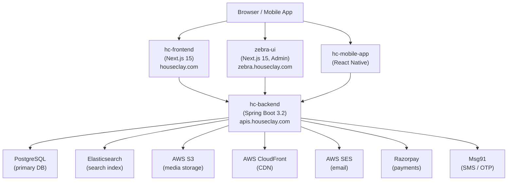

# Houseclay — Monorepo

Houseclay was a production-grade residential real estate marketplace for India, built from the ground up with passion across 1,300+ commits. It served **1,000–5,000 daily active users at peak**, covering property search, listing, and owner-contact flows for Rent, Resale, and Flatmate categories — with a dedicated admin portal for moderation and operations.

The platform has been **shut down due to operational reasons**. This repository is preserved as an archive of the work and engineering that went into it.

> **Infrastructure freeze (2026-05-11):** AWS EC2, RDS, and CloudFront are shut down to minimise cost. Only Route 53 (mail) remains live. Local development works as documented below. Production endpoints (`houseclay.com`, `apis.houseclay.com`, `zebra.houseclay.com`, `cdn.houseclay.com`) are offline. See [`docs/freeze-2026-05/`](./docs/freeze-2026-05/README.md) for the revival runbook.

---

## Repository Structure

```
houseclay-Public/
├── hc-backend/          # Java Spring Boot REST API
├── hc-frontend/         # Next.js 15 main website (houseclay.com)
├── zebra-ui/            # Next.js 15 admin portal (zebra.houseclay.com)
├── hc-mobile-app/       # React Native iOS + Android app
├── hc-sdk/              # Shared SDK (in progress)
├── old-zebra-ui/        # Discarded Vite+MUI admin (archived)
├── docs/                # Architecture & ops runbooks
├── docker-compose.yml   # Full-stack local orchestration
└── SETUP.md             # Developer setup guide
```

---

## System Architecture



---

## Services at a Glance

| Service | Stack | Port (local) | Purpose |
|---------|-------|-------------|---------|
| `hc-backend` | Java 17, Spring Boot 3.2 | `8080` | REST API, auth, payments, search |
| `hc-frontend` | Next.js 15, React 19 | `3000` | Public-facing property marketplace |
| `zebra-ui` | Next.js 15, React 19 | `3001` | Internal admin & moderation portal |
| `hc-mobile-app` | React Native 0.84 | — | iOS + Android companion app |
| Postgres | PostgreSQL 16 | `5432` | Primary relational database |
| Elasticsearch | 8.10.2 | `9200` | Property full-text search |
| pgAdmin | pgAdmin 4 | `8081` | Database GUI |

---

## Local Development

Full instructions are in [SETUP.md](./SETUP.md). Quick reference below.

### Prerequisites

- Docker Desktop
- Node.js v22+ (for Method B / frontend dev)
- `mkcert` (for HTTPS in Method B)

### Root `.env`

Create `.env` in the repo root before any `docker compose` command:

```env
POSTGRES_USER=postgres
POSTGRES_PASSWORD=<your-db-password>
POSTGRES_DB=houseclay_local
POSTGRES_PORT=5432
ELASTIC_PORT=9200
PGADMIN_EMAIL=admin@houseclay.com
PGADMIN_PASSWORD=<your-pgadmin-password>
PGADMIN_PORT=8081
MAIN_APP_PORT=3000
ADMIN_APP_PORT=3001
```

### Docker Profiles

```bash
# Backend + DB only
docker compose --profile backend up

# Main website + Backend
docker compose --profile houseclay up

# Admin portal + Backend
docker compose --profile zebra up

# Full stack (everything)
docker compose --profile full-setup up
```

### Method B — Frontend locally, Backend in Docker

```bash
# 1. Start backend infra
docker compose --profile backend up

# 2. Run main website locally
cd hc-frontend && npm install && npm run dev:local

# 3. Run admin portal locally (separate terminal)
cd zebra-ui && npm install && npm run dev:local
```

---

## Key Domain Concepts

**Properties** come in three categories, modelled as a single-table inheritance hierarchy:

| Category | Description |
|----------|-------------|
| `RENT` | Rental listings (apartments, rooms) |
| `RESALE` | Sale listings |
| `FLATMATE` | Flatmate/co-living search |

**Connects** — marketplace currency. Users purchase connect bundles to unlock owner contact details. Each connect expires in 30 days.

**Dual Auth Streams** — separate token filters and endpoint namespaces for regular users (`/api/user/**`) and admins (`/api/admin/**`).

---

## Tech Choices

| Concern | Choice | Why |
|---------|--------|-----|
| API | Spring Boot 3 | Mature Java ecosystem, JPA, strong security primitives |
| Frontend | Next.js 15 App Router | SSR/SSG, image optimisation, file-based routing |
| Admin | Next.js 15 (separate app) | Independent deploy, shared patterns with frontend |
| Mobile | React Native | Code-share with React web layer; iOS + Android from one codebase |
| State | Redux Toolkit + RTK Query | Predictable, persisted, cache-aware |
| Search | Elasticsearch | Decoupled full-text search without impacting Postgres |
| Media | S3 + CloudFront | Presigned uploads, CDN delivery, no server bottleneck |
| Email | AWS SES + FreeMarker | Transactional templated emails at scale |
| Payments | Razorpay | India-first payment gateway |
| OTP / SMS | Msg91 | India-first SMS gateway, reliable OTP delivery |
| Database | PostgreSQL 16 | Relational, strong consistency, JPA-native, complex query support |

---

## Screenshots

<!-- TODO: Add screenshots -->

---

## Sub-project READMEs

- [hc-backend](./hc-backend/README.md) — API reference, environment variables, architecture
- [hc-frontend](./hc-frontend/README.md) — Pages, state management, component system
- [zebra-ui](./zebra-ui/README.md) — Admin portal, auth, E2E tests
- [hc-mobile-app](./hc-mobile-app/README.md) — React Native setup, navigation, design system
- [hc-sdk](./hc-sdk/README.md) — Shared SDK (in progress)
- [old-zebra-ui](./old-zebra-ui/README.md) — Archived predecessor (Vite + MUI)

---

## License

© 2024–2026 Houseclay. All Rights Reserved.

This repository is shared publicly for transparency and portfolio purposes. The source code, design, architecture, and all associated assets remain the exclusive intellectual property of their authors. **Copying, reproduction, redistribution, or derivative use — in whole or in part — is strictly prohibited without prior written consent.**
