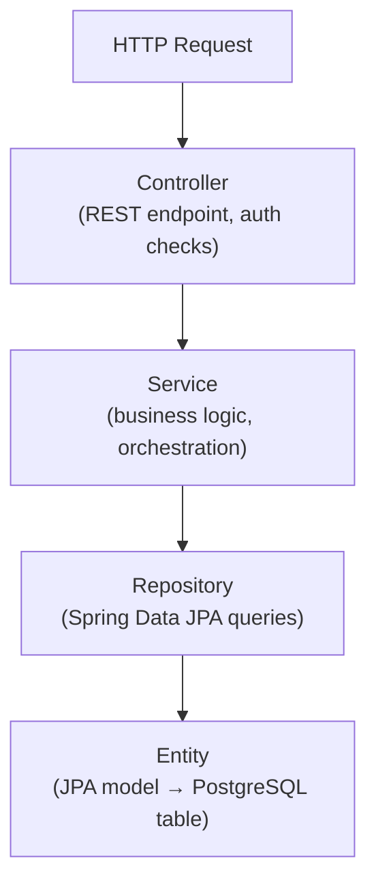

# hc-backend

Java Spring Boot REST API powering the Houseclay marketplace. Handles all business logic: property lifecycle, user auth, connects marketplace, payments, search, and email notifications.

---

## Tech Stack

| Layer | Technology |
|-------|-----------|
| Language | Java 17 |
| Framework | Spring Boot 3.2.5 |
| ORM | Spring Data JPA + Hibernate |
| Security | Spring Security (custom token filters) |
| Database | PostgreSQL 16 |
| Search | Elasticsearch 8.10 |
| Storage | AWS S3 + CloudFront (CDN) |
| Email | AWS SES + FreeMarker templates |
| Payments | Razorpay SDK |
| SMS / OTP | Msg91 |
| Build | Maven 3.9 |
| Container | Docker (multi-stage) |
| API Docs | Springdoc OpenAPI 2.2 (Swagger UI) |

---

## Folder Structure

```
hc-backend/
└── backend/
    ├── src/main/
    │   ├── java/com/houseclay/backend/
    │   │   ├── controller/       # 14 REST controllers
    │   │   ├── service/          # 20+ service classes
    │   │   ├── entity/           # 35+ JPA entities
    │   │   ├── repository/       # 18+ Spring Data repositories
    │   │   ├── dto/              # 30+ request/response DTOs
    │   │   ├── mapper/           # Entity ↔ DTO mappers
    │   │   ├── payload/          # Inbound request payloads
    │   │   ├── enums/            # Domain enumerations
    │   │   ├── security/         # Token auth filters
    │   │   ├── config/           # Spring configuration classes
    │   │   ├── scheduler/        # @Scheduled background jobs
    │   │   ├── exception/        # Global exception handlers
    │   │   └── utils/            # Utility helpers
    │   └── resources/
    │       ├── application.properties
    │       └── templates/        # 25+ FreeMarker email templates
    ├── Dockerfile                # Multi-stage Maven → JRE image
    └── pom.xml
```

---

## Architecture

### Layered Design



### Polymorphic Properties (Single-Table Inheritance)

All property categories share one `properties` table, discriminated by `property_category`:

```
Property (base)
├── RentProperty     (RENT)
├── SaleProperty     (RESALE)
└── FlatmateProperty (FLATMATE)
```

Jackson's `@JsonTypeInfo` / `@JsonSubTypes` handles polymorphic serialisation on the API layer.

### Dual Auth Streams

Two independent `OncePerRequestFilter` implementations guard separate endpoint namespaces:

| Stream | Filter | Namespace |
|--------|--------|-----------|
| User | `UserTokenAuthenticationFilter` | `/api/user/**`, `/api/property/**`, etc. |
| Admin | `AdminTokenAuthenticationFilter` | `/api/admin/**`, `/api/admin-user/**` |

Sessions are stored as tokens in Postgres. Max 5 concurrent sessions per user, configurable via env.

### Connects Marketplace

A virtual currency system for contacting property owners:

1. User purchases a connect bundle (Razorpay order → payment verification).
2. Connects are credited with a 30-day expiration.
3. Viewing owner contact details debits one connect.
4. Expired connects are purged by a scheduled job.

---

## API Endpoints (Overview)

| Group | Base Path | Auth |
|-------|-----------|------|
| Auth / OTP | `/api/auth/**` | Public |
| User management | `/api/user/**` | User token |
| Property (public) | `/api/property/**` | Public / User token |
| Property (user actions) | `/api/property-user/**` | User token |
| Property (admin) | `/api/property-admin/**` | Admin token |
| Leads | `/api/leads/**` | User token |
| Payments | `/api/payment/**` | User token |
| Bundles | `/api/bundle/**` | User token |
| Shortlist | `/api/shortlist/**` | User token |
| Photos | `/api/photo/**` | Public (presigned) |
| Contact us | `/api/contact-us` | Public |
| Admin | `/api/admin/**` | Admin token |
| Admin users | `/api/admin-user/**` | Admin token |

Full interactive docs at `http://localhost:8080/swagger-ui.html` when running locally.

---

## Background Jobs

| Scheduler | Trigger | Purpose |
|-----------|---------|---------|
| `PaymentCleaner` | Cron | Purge stale pending Razorpay orders |
| Connect expiry | Cron | Expire used/old connect bundles |
| Property routine | Cron | Re-index stale or unpublished properties |
| Corporate domain refresh | Cron | Sync corporate email domain list |

---

## Email Templates

25+ FreeMarker templates under `src/main/resources/templates/`. Key ones:

- `welcome.ftl` — new user registration
- `verify-email.ftl` — email OTP verification
- `property-listed.ftl` — listing confirmation to owner
- `lead-received.ftl` — new inquiry notification
- `payment-success.ftl`, `payment-failure.ftl` — payment receipts
- `connect-purchased.ftl` — connect bundle confirmation
- `corporate-verification.ftl` — enterprise domain verification

---

## Environment Variables

### Database

| Variable | Description |
|----------|-------------|
| `DATABASE_URL` | JDBC URL (e.g., `jdbc:postgresql://localhost:5432/houseclay_local`) |
| `DATABASE_USERNAME` | Postgres username |
| `DATABASE_PASSWORD` | Postgres password |

### Elasticsearch

| Variable | Description |
|----------|-------------|
| `ELASTIC_SEARCH_URL` | Elasticsearch URI (e.g., `http://localhost:9200`) |

### AWS

| Variable | Description |
|----------|-------------|
| `AWS_ACCESS_KEY` | IAM access key |
| `AWS_SECRET_KEY` | IAM secret key |
| `AWS_REGION` | Region (e.g., `ap-south-1`) |
| `S3_BUCKET` | S3 bucket name |
| `CLOUDFRONT_DOMAIN` | CloudFront distribution domain |
| `CLOUDFRONT_KEY_PAIR_ID` | CloudFront key pair ID |
| `CLOUDFRONT_PRIVATE_KEY` | CloudFront signing private key |

### Payments & SMS

| Variable | Description |
|----------|-------------|
| `RAZORPAY_KEY_ID` | Razorpay public key |
| `RAZORPAY_KEY_SECRET` | Razorpay secret key |
| `MSG91_AUTH_KEY` | Msg91 authentication key |

### Session & Security

| Variable | Default | Description |
|----------|---------|-------------|
| `SESSION_DURATION_DAYS` | `7` | Token lifetime |
| `SESSION_MAX_ACTIVE` | `5` | Max concurrent sessions per user |
| `OTP_SECRET` | — | HMAC secret for OTP signing |
| `COOKIE_DOMAIN` | — | Cookie domain (e.g., `.houseclay.com`) |

---

## Running Locally

### Via Docker (recommended)

```bash
# From monorepo root
docker compose --profile backend up
```

Starts Postgres, Elasticsearch, pgAdmin, and the Spring Boot app.

### Via Maven (backend only)

```bash
cd hc-backend/backend
cp .env.example .env   # fill in secrets
./mvnw spring-boot:run
```

### Building the Docker image

```bash
cd hc-backend/backend
docker build -t houseclay-backend .
```

The Dockerfile uses a two-stage build:
1. `maven:3.9-eclipse-temurin-17` — downloads dependencies offline, compiles and packages the JAR.
2. `eclipse-temurin:17-jre-alpine` — copies only the JAR; minimal runtime image.

---

## CORS

Pre-configured allowed origins:

- `https://houseclay.com`, `https://www.houseclay.com`
- `https://zebra.houseclay.com`
- `http://localhost:3000`, `http://localhost:3001`
- `https://localhost:3000`, `https://localhost:3001`

Cookies use `SameSite=None; Secure` and `Domain=.houseclay.com` for cross-subdomain auth.

---

## Coding Conventions

### Package layout

Follow the existing layered structure strictly — controllers call services, services call repositories, repositories call nothing above them. Business logic belongs in the service layer, not in controllers or entities.

### Entities and DTOs

Never expose JPA entities directly from the API. Always map to a DTO at the controller boundary using the `mapper/` classes. This keeps the API contract stable independent of schema changes.

### Exception handling

Throw domain-specific exceptions from the service layer. The global handler in `exception/` translates them to HTTP responses — controllers should not contain try/catch blocks.

### Scheduled jobs

All `@Scheduled` methods live in `scheduler/`. Keep them thin — delegate to a service method, never write business logic inline in the scheduler class.

### Email templates

FreeMarker templates in `resources/templates/` use the naming pattern `<action>.ftl`. Template data models are plain Java objects passed from the service layer — do not inject Spring beans into templates.

---

## License

© 2024–2026 Houseclay. All Rights Reserved.

This repository is shared publicly for transparency and portfolio purposes. The source code, design, architecture, and all associated assets remain the exclusive intellectual property of their authors. **Copying, reproduction, redistribution, or derivative use — in whole or in part — is strictly prohibited without prior written consent.**
