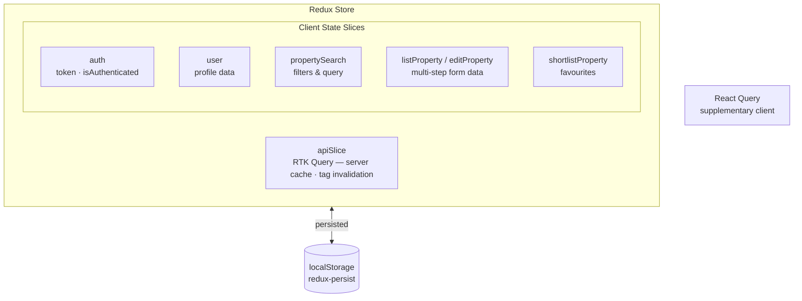
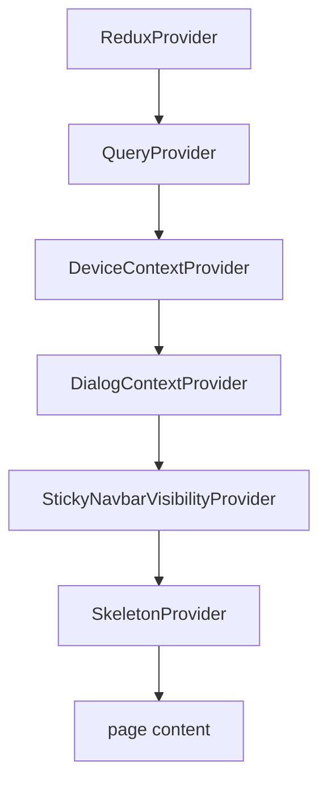

# hc-frontend

Next.js 15 main website for Houseclay — the public-facing property marketplace at `houseclay.com`. Covers property search, listing, owner contact flows, and account management.

> Bootstrapped with [`create-next-app`](https://nextjs.org/docs/app/api-reference/cli/create-next-app).

---

## Tech Stack

| Concern | Library |
|---------|---------|
| Framework | Next.js 15.3 (App Router) |
| UI | React 19, TypeScript 5 |
| Styling | Tailwind CSS 3.4 |
| State | Redux Toolkit 2.6 + redux-persist |
| API / Cache | RTK Query + React Query 5 |
| Forms | Formik 2 + Yup |
| HTTP | Axios 1.8 |
| Animation | Framer Motion 12 |
| Maps | @vis.gl/react-google-maps |
| Media upload | Evaporate (S3 multipart) |
| Testing | Storybook 8 (component stories) |
| Icons | Lucide React |

---

## Folder Structure

```
hc-frontend/src/
├── app/                      # Next.js App Router pages
│   ├── (home)/               # Home page (grouped route)
│   ├── property-search/      # Property listing & filters
│   ├── property-details/     # Single property view
│   ├── list-property/        # Owner: create a listing
│   ├── edit-property/        # Owner: edit existing listing
│   ├── find-flatmates/       # Flatmate search
│   ├── login/
│   ├── manage-account/
│   ├── my-property-details/  # Owner dashboard
│   ├── standouts/
│   ├── testimonials/
│   └── [static pages]/       # About, FAQs, Privacy, Terms, Contact
│
├── base-components/          # UI atoms (Button, TextField, Select…)
├── form-components/          # Formik-aware form fields
├── components/               # Feature-level components (20+)
├── layout-components/        # Header, Footer, StickyNavbar, Dialogs shell
├── dialogs/                  # 22+ modal dialogs
├── utility-components/       # Gallery, Map, Tabs, Icons
│
├── store/                    # Redux slices + RTK Query
│   ├── store.ts
│   ├── authSlice.ts
│   ├── userSlice.ts
│   ├── apiSlice.ts           # RTK Query endpoint definitions
│   ├── propertySearchSlice.ts
│   ├── listPropertySlice.ts
│   ├── editPropertySlice.ts
│   ├── shortlistPropertySlice.ts
│   └── uploadToS3Slice.ts
│
├── providers/                # Provider composition
│   ├── Providers.tsx         # Root: wraps all providers
│   ├── ReduxProvider.tsx
│   ├── QueryProvider.tsx
│   ├── DeviceContextProvider.tsx
│   ├── DialogContextProvider.tsx
│   └── StickyNavbarVisibilityProvider.tsx
│
├── services/                 # Axios instances & API service helpers
│   ├── axiosInstance.ts      # Client-side (with 401 interceptor)
│   ├── serverAxiosInstance.ts
│   └── authService.ts
│
├── hooks/                    # Custom hooks
├── interfaces/               # 30+ TypeScript types
├── common/                   # Constants, enums, CDN URLs
├── utils/                    # formHelpers, rtkQueryHelpers, etc.
├── actions/                  # Next.js Server Actions
├── data/                     # Static data and JSON fixtures
├── icons/                    # SVG assets and icon components
├── hoc/                      # Higher-order components
└── middleware.ts             # Next.js middleware (route guards)
```

### Folder Reference

- **app**: Pages and route segments per Next.js App Router.
- **base-components**: Foundational UI primitives (e.g., Button, Autocomplete, Input).
- **components**: Reusable feature-level UI components.
- **services**: API clients and service-layer utilities.
- **layout-components**: Layout wrappers (headers, footers, containers, grids).
- **hooks**: Custom React hooks.
- **interfaces**: TypeScript interfaces and types.
- **common**: Shared constants and utility helpers.
- **form-components**: Form fields and form-specific components/integrations.
- **utility-components**: Small helper/presentation components (e.g., loaders, skeletons).
- **data**: Static data and JSON fixtures.
- **icons**: SVG assets and icon components.
- **providers**: App-level context/providers (theme, store, etc.).
- **store**: State management setup (slices, selectors, configuration).
- **dialogs**: Modal and dialog components.
- **hoc**: Higher-order components.
- **utils**: General-purpose utility functions.
- **stories**: Storybook stories and examples.

---

## Architecture

### State Management



**Key rule:** RTK Query is the primary data-fetching layer. React Query is used in a few isolated flows.

#### How Redux + RTK Query work together

Redux Toolkit manages **client state** (auth tokens, UI state, in-progress form data). RTK Query manages **server state** (API responses, caching, refetching).

All API endpoints are defined in `store/apiSlice.ts` using `createApi`. Each endpoint produces auto-generated hooks (`useGetPropertiesQuery`, `useCreatePropertyMutation`, etc.) that components consume directly — no manual `dispatch` or `useEffect` required for data fetching.

Tag-based cache invalidation keeps the UI consistent: a successful mutation (e.g., listing a property) invalidates the relevant `Property` tag, causing any active query that provides that tag to automatically refetch.

```ts
// Defining an endpoint
const apiSlice = createApi({
  reducerPath: "api",
  baseQuery: axiosFetchBase,
  tagTypes: ["Property", "User", "Connects"],
  endpoints: (builder) => ({
    getProperties: builder.query<PropertyListResponse, PropertySearchParams>({
      query: (params) => ({ url: "/properties", params }),
      providesTags: ["Property"],
    }),
    createProperty: builder.mutation<Property, CreatePropertyPayload>({
      query: (body) => ({ url: "/properties", method: "POST", data: body }),
      invalidatesTags: ["Property"],
    }),
  }),
});

// Consuming in a component
const { data, isLoading } = useGetPropertiesQuery(filters);
const [createProperty, { isLoading: isSaving }] = useCreatePropertyMutation();
```

`redux-persist` serialises the full Redux store to `localStorage` on every state change, so slices like `listProperty` (multi-step form data) and `auth` survive page refreshes automatically.

### Provider Stack (outermost → innermost)



### API Communication

- All API calls proxy through Next.js rewrites: `/api/*` → `https://apis.houseclay.com/api/*`
- Client-side Axios instance auto-redirects to `/login` on `401`.
- Separate server-side Axios instances for SSR data fetching (authenticated + anonymous).
- `NEXT_PUBLIC_HOUSECLAY_API_BASE_URL` controls the base URL in different environments.

### Form Pattern

All multi-step forms (List Property, Edit Property) follow this flow:

```
User input (Formik field)
   → Yup validation
   → Redux slice update (persisted to localStorage)
   → Final submit → RTK Query mutation → API
```

Form state survives page refreshes and browser restarts.

#### How Formik + Yup work together

Formik owns the **in-component form state** (field values, touched flags, submission state). Yup provides the **validation schema** passed to Formik via `validationSchema`. On every field change or blur, Formik runs the Yup schema and surfaces errors through `formik.errors`.

`form-components/` contains Formik-aware wrappers (e.g., `FormTextField`, `FormSelect`) that wire `field`, `meta`, and `helpers` from `useField()` so individual fields don't need to know about Formik directly.

```tsx
// Yup schema
const schema = Yup.object({
  title: Yup.string().required("Title is required").max(100),
  rent: Yup.number().positive("Must be > 0").required(),
});

// Formik setup
<Formik
  initialValues={reduxSlice}       // pre-populated from Redux (persisted)
  validationSchema={schema}
  onSubmit={(values) => {
    dispatch(updateListPropertySlice(values)); // save to Redux
    createProperty(values);                   // RTK Query mutation
  }}
>
  {({ handleSubmit }) => (
    <form onSubmit={handleSubmit}>
      <FormTextField name="title" label="Property title" />
      <FormTextField name="rent" label="Monthly rent" type="number" />
    </form>
  )}
</Formik>

// Inside FormTextField
const FormTextField = ({ name, ...props }) => {
  const [field, meta] = useField(name);
  return (
    <TextField
      {...field}
      {...props}
      error={meta.touched && Boolean(meta.error)}
      helperText={meta.touched && meta.error}
    />
  );
};
```

For multi-step flows, each step dispatches its validated values into the Redux slice before navigating to the next step. The final step submits the accumulated Redux state as one API call.

---

## Pages & Features

| Page | Route | Description |
|------|-------|-------------|
| Home | `/` | Hero, featured listings, CTA sections |
| Property Search | `/property-search` | Filter by location, price, BHK, category, furnishing, amenities |
| Property Details | `/property-details/[id]` | Full listing, photo gallery, neighbourhood, contact owner |
| List Property | `/list-property` | Multi-step wizard (Rent / Resale / Flatmate) |
| Edit Property | `/edit-property` | Modify existing listing |
| Find Flatmates | `/find-flatmates` | Flatmate-specific search & cards |
| My Property Details | `/my-property-details` | Owner dashboard — analytics, leads, actions |
| Manage Account | `/manage-account` | Profile, email verification, settings |
| Login | `/login` | OTP-based phone authentication |
| Standouts | `/standouts` | Featured / promoted listings |

### Key Dialogs (loaded lazily)

- `login-dialog` — auth gate before gated actions
- `search-filters-dialog` / `sort-filters-dialog` — filter sheet on mobile
- `photo-gallery-dialog` — full-screen property gallery
- `unlock-owner-details-dialog` — connect spend confirmation
- `connects-verification-dialog` — connect balance check
- `list-property-success-dialog` — post-submit confirmation
- `report-property-dialog` — flag a listing

---

## Component Organisation

| Folder | Role | Examples |
|--------|------|---------|
| `base-components/` | Unstyled / lightly styled atoms | `Button`, `TextField`, `SelectDropdown`, `RangeSlider`, `PhotoUpload`, `PlacesAutocomplete` |
| `form-components/` | Formik-wired wrappers | `FormTextField`, `FormSelect` |
| `layout-components/` | Page shells | `Header`, `MobileHeader`, `Footer`, `StickyNavbar`, `PageTransition` |
| `components/` | Feature components | `Properties`, `Login`, `Standouts`, `CardCarousel`, `UserDropdown` |
| `utility-components/` | Complex reusable widgets | Photo gallery, map embed, tab panels, icon registry |
| `dialogs/` | Full-screen or sheet modals | See list above |

---

## Running Locally

### Docker (zero setup)

```bash
# From monorepo root
docker compose --profile houseclay up
# → http://localhost:3000
```

### Local Node

```bash
cd hc-frontend
npm install

# HTTP (Docker backend)
npm run dev:local

# HTTPS with custom domain (requires mkcert)
npm run dev:hosted
```

### Environment Variables

| Variable | Dev default | Description |
|----------|-------------|-------------|
| `NEXT_PUBLIC_HOUSECLAY_API_BASE_URL` | `http://localhost:8080/api` | Backend base URL |
| `NEXT_PUBLIC_GOOGLE_MAPS_API_KEY` | — | Google Maps key |
| `NEXT_PUBLIC_RAZORPAY_KEY_ID` | — | Razorpay client key |
| `USE_HTTPS` | `false` | Enable custom HTTPS server (`server.mjs`) |

---

## Custom Server (`server.mjs`)

A thin Node.js wrapper around the Next.js server that toggles HTTP vs HTTPS based on `USE_HTTPS`, auto-selects an available port, and enables Turbopack in development.

---

## Coding Guidelines

### Component Organisation

- **Mobile-first**: Write base classes for mobile; add `md:` and `lg:` overrides as needed.
- **Tablet-specific layouts**: To target tablet-only behaviors, set styles at `md:` and then override again at `lg:`. Pair with `max-md:` for the mobile case.
- **Large screens**: Do not add larger breakpoints by default. The UI should adapt for `md:` and `lg:`. Use `xl`, `2xl`, or `3xl` only when necessary for images or typography rendering fidelity.
- **Avoid custom media queries** unless there is a documented, exceptional need.

### Styling with Tailwind CSS

- Use Tailwind for all styling. Prefer utility classes; avoid custom CSS unless strictly necessary.
- Build mobile-first, then layer responsive overrides with `md:` and `lg:`.

### Responsive breakpoints

We use three core breakpoints (Tailwind defaults):

- **`max-md:`**: Mobile-only styles (applies below `md`).
- **`md:`**: Applies at and above tablet (tablet and desktop baseline).
- **`lg:`**: Applies at and above desktop.

Guidelines:

- **Mobile-first**: Write base classes for mobile; add `md:` and `lg:` overrides as needed.
- **Tablet-specific layouts**: To target tablet-only behaviors, set styles at `md:` and then override again at `lg:`. Pair with `max-md:` for the mobile case.
- **Large screens**: Do not add larger breakpoints by default. The UI should adapt for `md:` and `lg:`. Use `xl`, `2xl`, or `3xl` only when necessary for images or typography rendering fidelity.
- **Avoid custom media queries** unless there is a documented, exceptional need.

Examples:

```html
<!-- Mobile: 1 col, Tablet: 2 cols, Desktop: 3 cols -->
<div class="grid grid-cols-1 md:grid-cols-2 lg:grid-cols-3"></div>

<!-- Tablet-only visibility: hidden on mobile and desktop -->
<div class="hidden md:block lg:hidden"></div>

<!-- Mobile-specific tweak -->

```

### Sizing and Spacing (height, width, margin, padding)

#### Height and width

- Prefer Tailwind utilities up to `h-96` / `w-96`, or fractional sizes like `h-1/2`, `w-1/2`, etc.
- Avoid custom pixel or percentage sizes unless strictly required by the design.
- Let content flow naturally; only constrain when there is a clear design need.

Examples:

```html
<div class="h-64 w-full md:h-80 lg:h-96"></div>

```

#### Padding, margin, and containers

- Standard horizontal padding for major containers:
  - `xl:px-24 lg:px-12 md:px-8 px-4`
  - Vertical padding (`py-*`) depends on the design; choose per context.
- On standalone mobile UI, horizontal padding is always `px-6`.
- For very wide screens or pages that don't scale nicely, wrap content with Tailwind's `container` utility to keep a readable max width.

Examples:

```html
<section
  class="container mx-auto xl:px-24 lg:px-12 md:px-8 px-4 py-8"
></section>
```

#### Sectioning and structure

- Group related UI into semantic `<section>` blocks for readability and layout control.
- Place desktop markup first and mobile markup below it.
- Use sections and comments to separate logical chunks.

```html
<!-- Desktop section -->
<section class="hidden md:block">...</section>

<!-- Mobile section -->
<section class="block md:hidden">...</section>
```

#### Visibility and performance

- We do not conditionally render desktop vs mobile with JavaScript for performance reasons.
- Load both desktop and mobile DOM where necessary, and control visibility with CSS:
  - `max-md:hidden` to hide on mobile
  - `md:hidden` to hide on tablet and above

Examples:

```html
<!-- Shown on desktop/tablet, hidden on mobile -->
<div class="max-md:hidden">Desktop/tablet UI</div>

<!-- Shown on mobile, hidden from tablet upward -->
<div class="md:hidden">Mobile UI</div>
```

#### When conditional rendering is needed

- If CSS alone cannot express the behavior (e.g., choosing a dialog type, coordinating an animation), use the device context:
  - `useDeviceContext()` from `providers/DeviceContextProvider.tsx` exposes `{ isMobile, isTablet, isDesktop }`.

```tsx
import { useDeviceContext } from "@/providers/DeviceContextProvider";

const Example = () => {
  const { isMobile, isTablet, isDesktop } = useDeviceContext();
  return isMobile ? <MobileDialog /> : <DesktopDialog />;
};
```

#### Main content wrapper

- Header/footer offsets are already handled; you don't need extra CSS for margins/paddings. Use the shared main wrapper:

```html
<main
  class="mx-auto my-0 pt-14 max-md:pb-16 flex-1 flex flex-col justify-center"
></main>
```

---

## License

© 2024–2026 Houseclay. All Rights Reserved.

This repository is shared publicly for transparency and portfolio purposes. The source code, design, architecture, and all associated assets remain the exclusive intellectual property of their authors. **Copying, reproduction, redistribution, or derivative use — in whole or in part — is strictly prohibited without prior written consent.**
