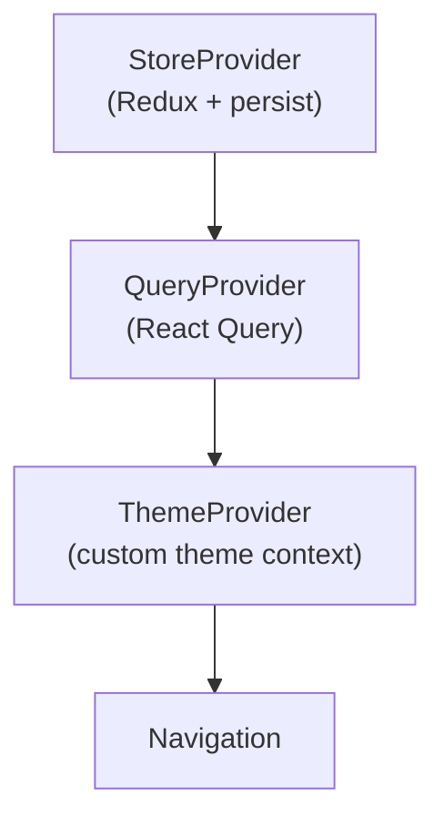
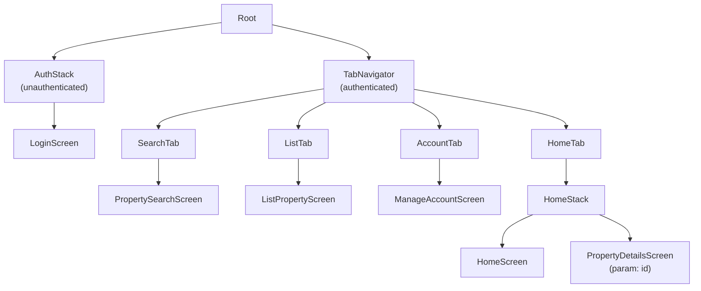

# hc-mobile-app

React Native 0.84 iOS + Android companion app for Houseclay. Mirrors the core user flows of `hc-frontend` — property search, listing, owner contact, and account management — in a native mobile experience.

---

## Tech Stack

| Concern | Library |
|---------|---------|
| Framework | React Native 0.84.1, React 19 |
| Language | TypeScript 5.8 (strict mode) |
| Navigation | React Navigation 7 (native stack + bottom tabs) |
| State | Redux Toolkit 2.11 + redux-persist (AsyncStorage) |
| Server state | TanStack React Query 5.91 |
| Forms | Formik 2.4 + Yup 1.7 |
| UI components | React Native Paper 5 (Material Design 3) |
| Animations | React Native Reanimated 4 |
| Gestures | React Native Gesture Handler 2.30 |
| HTTP | Axios 1.13 |
| Persistence | @react-native-async-storage/async-storage |
| Testing | Jest 29 |

---

## Folder Structure

```
hc-mobile-app/src/
├── app/
│   ├── App.tsx              # Root component — mounts providers
│   ├── Navigation.tsx       # Navigator definitions
│   └── providers/
│       ├── StoreProvider.tsx   # Redux + redux-persist
│       ├── QueryProvider.tsx   # React Query client
│       └── ThemeProvider.tsx   # Custom theme context
│
├── screens/
│   ├── auth/LoginScreen.tsx
│   ├── home/HomeScreen.tsx
│   ├── property-search/PropertySearchScreen.tsx
│   ├── property-details/PropertyDetailsScreen.tsx
│   ├── list-property/ListPropertyScreen.tsx
│   └── manage-account/ManageAccountScreen.tsx
│
├── base-components/         # UI atoms (Button, TextField, Select…)
├── form-components/         # Formik-integrated wrappers + withFormikField HOC
├── layout-components/       # ScreenWrapper (safe area + keyboard)
│
├── design-system/
│   ├── tokens/
│   │   ├── tokens.ts        # Shared base tokens
│   │   ├── tokens.ios.ts    # iOS-specific overrides
│   │   └── tokens.android.ts # Android-specific overrides
│   └── primitives/          # Card, Surface, AppBar, BottomBar, Sheet
│       ├── Card.tsx / Card.ios.tsx / Card.android.tsx
│       └── [per-platform variants for each primitive]
│
├── store/
│   ├── store.ts             # Redux store (persist whitelist: auth, user)
│   ├── authSlice.ts         # token, refreshToken, isAuthenticated
│   ├── userSlice.ts         # id, name, email, phone
│   └── propertySearchSlice.ts # search filters (session-only)
│
├── services/
│   ├── axiosInstance.ts     # Bearer token injection + 401 logout
│   └── authService.ts       # login, register, refreshToken, logout
│
├── hooks/
│   ├── useAppDispatch.ts    # Typed Redux dispatch
│   └── useAppSelector.ts    # Typed Redux selector
│
├── interfaces/
└── utils/
```

---

## Architecture

### Provider Stack



### Navigation Structure



### State Layers

| Layer | Tool | Persisted? | Responsibility |
|-------|------|-----------|---------------|
| Local | React `useState` | No | Component UI state |
| Global | Redux Toolkit | Yes (auth, user) | Auth tokens, user profile |
| Server | React Query | No (cache only) | API responses, staleTime 5 min |

`propertySearch` slice is **intentionally excluded** from redux-persist — search state resets on app restart.

### API Integration

- `axiosInstance` attaches `Authorization: Bearer <token>` from Redux on every request.
- `401` responses dispatch the logout action, clearing persisted auth.
- Base URL: `http://localhost:8080/api` (dev) / `https://apis.houseclay.com/api` (prod).

### Form Pattern

`withFormikField` is a Higher-Order Component that wires any base component into a Formik form, avoiding per-component boilerplate:

```tsx
const FormTextField = withFormikField(TextField);
// Usage in a Formik form: <FormTextField name="email" label="Email" />
```

---

## Design System

### Design Tokens

Located in `src/design-system/tokens/`. Values are platform-split for native look and feel:

| Token | iOS | Android |
|-------|-----|---------|
| Colors | iOS HIG semantic system colors | Material Design 3 palettes |
| Typography | SF Pro (system font) | Roboto |
| Border radius | Larger, pill-like | MD3 shape scale |
| Elevation | Shadow-based | Material elevation 0–5 |
| Spacing | 4 / 8 / 12 / 16 / 24 / 32 / 48 px | Same |

### Platform-Specific Primitives

`Card`, `Surface`, `AppBar`, `BottomBar`, `Sheet` each have three files. React Native's bundler automatically resolves `.ios.tsx` / `.android.tsx` at build time:

```
Card.tsx          ← shared base
Card.ios.tsx      ← iOS overrides (resolved on iOS)
Card.android.tsx  ← Android overrides (resolved on Android)
```

### Theming

`ThemeProvider` wraps `useColorScheme()` (system dark/light) and exposes a `useTheme()` hook. Components pull colour tokens from `useTheme()` rather than hard-coding values.

---

## Running Locally

### Prerequisites

- Node.js 22+
- Ruby + Bundler (iOS CocoaPods)
- Xcode (iOS) / Android Studio + SDK (Android)

### Install

```bash
cd hc-mobile-app
npm install

# iOS native deps (first clone or after updating native packages)
cd ios && bundle install && bundle exec pod install && cd ..
```

### Start

```bash
# Metro bundler
npm start

# iOS Simulator
npm run ios

# Android Emulator
npm run android
```

### Backend URL

Edit `src/services/axiosInstance.ts` and set `baseURL` to your local backend (`http://localhost:8080/api`).

---

## Testing

```bash
npm test          # Jest unit tests
npm test -- --watch
```

---

## Coding Guidelines

### TypeScript

- Strict mode is enabled — no `any`, no implicit `undefined`. Use discriminated unions over optional chaining chains.
- Type all Redux selectors and dispatches via `useAppSelector` / `useAppDispatch` (typed wrappers in `hooks/`).

### Platform-specific code

- Prefer `.ios.tsx` / `.android.tsx` file splits over `Platform.OS` conditionals inside a single file. The bundler resolves them at build time with zero runtime overhead.
- Design tokens are platform-split in `design-system/tokens/`. Pull values from there — never hard-code colors, spacing, or radii inline.

### Components

- Use `withFormikField(BaseComponent)` to wire any input into Formik. Do not duplicate `useField` wiring in each form component individually.
- `ScreenWrapper` from `layout-components/` handles safe area insets and keyboard avoidance. Wrap every screen with it.

### State

- Only `auth` and `user` slices are persisted (whitelist in `store.ts`). Keep `propertySearch` and any ephemeral filter state out of the whitelist intentionally.
- Server data lives in React Query — do not mirror API responses into Redux slices.

---

## License

© 2024–2026 Houseclay. All Rights Reserved.

This repository is shared publicly for transparency and portfolio purposes. The source code, design, architecture, and all associated assets remain the exclusive intellectual property of their authors. **Copying, reproduction, redistribution, or derivative use — in whole or in part — is strictly prohibited without prior written consent.**
